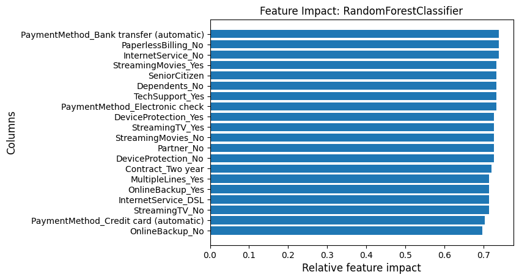
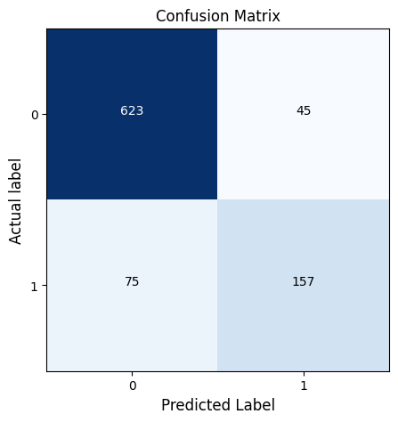
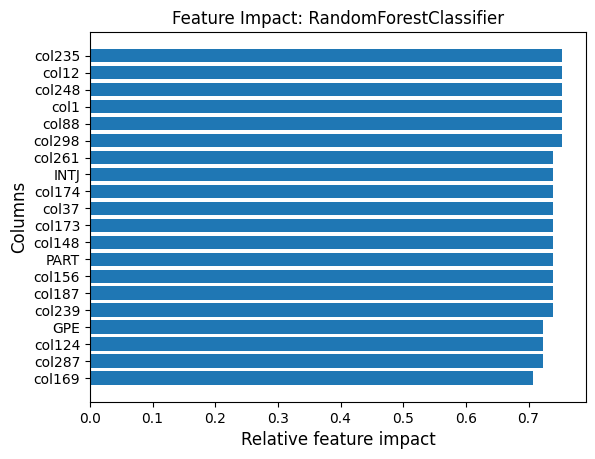
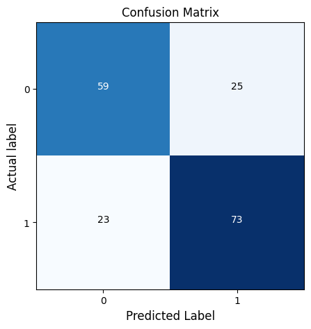
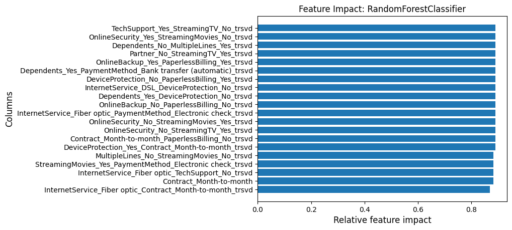
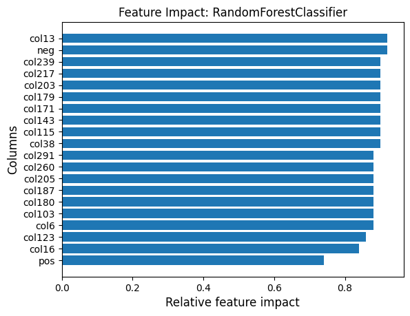

# ml toolkit q examples 07: Automated Machine Learning

The kdb+/q Automated Machine Learning module is built largely on the tools available within the ml and nlp modules of the kdb+/q ML-Toolkit. The purpose of this module is to provide users with the ability to automate the process of applying machine learning techniques to real-world problems. In the absence of expert machine learning engineers this framework handles the following processes within a traditional workflow:

- Data preprocessing
- Feature engineering and feature selection
- Model selection
- Hyperparameter tuning
- Report generation and model persistence

Each of these steps is outlined in depth within the documentation for this platform [here](../automl/docs). This allows users to understand the processes by which decisions are being made and the transformations which their data undergo during the production of the output models.

At present the supported machine learning problem types for classification and regression tasks and based on:
- One-to-one feature to target non time-series
- FRESH based feature extraction and model production
- NLP-based feature creation and word2vec transformation

The problems which can be solved by this framework will be expanded over time as will the available functionality.

### Multi-processing
This library supports multi-processed grid-search/cross-validation procedures and FRESH feature creation provided a user sets a number of secondary processes when starting the host q process. This can be done by passing a negative number to [q's -s command line option](https://code.kx.com/q/basics/cmdline/#-s-secondary-threads), eg `-s -8` for 8 secondary processes. The host process must also have a port open to communicate with these secondary processes either by [the -p option](https://code.kx.com/q/basics/cmdline/#-p-listening-port) (`-p 1234`) or via [the \p system command](https://code.kx.com/q/basics/syscmds/#p-listening-port).

The Kx Automated Machine Learning library is then loaded in as follows:
```q
\l automl/automl.q
.automl.loadfile`:init.q

// and a couple util functions
.util.round:{[val;round] round*"j"$val%round}

.util.printDateTimeId:{[mdl] -1"Model date: ",string[mdl`startDate],". Model time: ",string[mdl`startTime],"."}

.util.printSavedModelId:{[mdl] -1"Model Name: ",string[mdl`savedModelName],"."}
```

## Contents
Below, the notebook has been split into 3 distinct sections:
1. Default Configurations
1. Default NLP Configurations
1. Custom Configurations (Advanced)


## Telco Customer Churn
The [Telco Customer Churn dataset](https://www.kaggle.com/blastchar/telco-customer-churn/data) contains the following information.

- Data on 7,043 customers of a telecom provider provided by IBM
- Customer feature information including
    - What form of internet the user has (DSL/Fiber Optic)?
    - What are the users monthly payments?
    - How long has the customer been in their contract?
    - What services does the customer use? i.e. phone, internet, online backup, streaming etc.
- A target variable 'Churn' indicating if a user has cancelled their contract in the last month

In each case of the examples below, we aim to create a model which can accurately predict customer churn based on 20 features relating to each customer.

### load data
```q
\S 42

// load data and separate into features and target
telcoData:5000?("SSBSSISSSSSSSSSSSSFFS";(),",")0:`:telco.csv
telcoTarg:(`No`Yes!0 1)telcoData`Churn
telcoFeat:delete Churn from telcoData

// inspect data
-1"Shape of feature data is: ",(" x "sv string .ml.shape telcoFeat),"\n";
show 5#telcoFeat
-1"\nDistribution of target values:\n";
show update pcnt:.util.round[;.01]100*num%sum num from select num:count i by target from([]target:telcoTarg);
```
```
Shape of feature data is: 5000 x 20

customerID gender SeniorCitizen Partner Dependents tenure PhoneService MultipleLines InternetServ..
-------------------------------------------------------------------------------------------------..
5382-TEMLV Male   0             No      No         45     Yes          No            DSL         ..
5827-MWCZK Male   0             Yes     Yes        56     Yes          Yes           Fiber optic ..
3086-RUCRN Female 0             No      No         66     Yes          Yes           Fiber optic ..
5965-GGPRW Male   0             Yes     Yes        72     Yes          Yes           Fiber optic ..
2887-JPYLU Female 0             No      Yes        41     Yes          No            DSL         ..

Distribution of target values:
target| num  pcnt
------| ----------
0     | 3637 72.74
1     | 1363 27.26
```

### Prepare data
In order to test both the model generation and prediction steps of the workflow we split the dataset into a training and testing set where

Dataset form | Purpose                                                            | Percentage (%)
-------------|--------------------------------------------------------------------|---------------
Training     | Generate model for deployment using `.automl.fit`                  | 90
Testing      | Independent dataset to test application of `predict` functionality | 10

Note: We have set a random seed so that results can be replicated.
```q
\S 42
show telcoInputs:.ml.trainTestSplit[telcoFeat;telcoTarg;.1]
```
```
xtrain| +`customerID`gender`SeniorCitizen`Partner`Dependents`tenure`PhoneService`MultipleLines`In..
ytrain| 0 0 1 0 1 0 1 1 1 0 1 0 0 0 1 1 0 0 1 1 0 0 0 1 1 0 0 0 0 0 0 0 0 1 0 1 1 0 0 1 0 1 0 0 0..
xtest | +`customerID`gender`SeniorCitizen`Partner`Dependents`tenure`PhoneService`MultipleLines`In..
ytest | 0 1 0 0 1 0 0 0 0 0 1 0 0 0 0 0 0 0 0 0 0 0 0 0 0 0 0 1 1 0 0 0 1 0 0 0 0 1 0 0 0 1 0 1 0..
```

## Default Configurations
### Inputs
The automated machine learning pipeline will use the training features (`xtrain`) and targets (`ytrain`) from `telcoInputs` above as input to `.automl.fit`.

Appropriate preprocessing steps including feature creation and selection will be applied to the data before being passed to a variety of machine learning models, choosing the best performing model.

In this case, we select  `` `normal`` feature extraction as we have a 1-to-1 mapping between features and targets. We also use `` `class`` for the problem type as we are dealing with a binary classification problem.

#### Inportant:
For the purposes of this demonstration we will pass in a dictionary in place of the default parameter (::). In order to ensure replication for users of this notebook the random seed parameter `` `seed`` is set in this example with the remaining parameters defaulted.

```q
telcoFeats  :telcoInputs`xtrain       / features
telcoTarget :telcoInputs`ytrain       / targets
featureType1:`normal                  / normal feature extraction
problemType1:`class                   / classification problem
paramDict1  :enlist[`seed]!enlist 350 / default configuration
```

In the default configuration, information generated during the fitting of the model will we saved to the outputs folder. This includes metadata information, graphs, reports and the fitted model.

In addition to saving outputs, the function returns a dictionary with two keys:
- `modelInfo`: Metadata information generated from the pipeline such as preprocessing steps taken, significant features chosen and any other information needed to replicate the results.
- `predict`: A function containing all relevant information and procedures required to generate new predictions using the fit model

We can now run `.automl.fit` using the default setting with out training set from the Telco Customer Churn dataset.


```q
start:.z.t
model1:.automl.fit[telcoFeats;telcoTarget;featureType1;problemType1;paramDict1]
-1"\n.automl.fit took ",string .z.t-start;
-1"\nReturn of .automl.fit:\n",.Q.s[model1];
```
```
Executing node: automlConfig
Executing node: configuration
Executing node: targetDataConfig
Executing node: targetData
Executing node: featureDataConfig
Executing node: featureData
Executing node: dataCheck
Executing node: featureDescription

The following is a breakdown of information for each of the relevant columns in the dataset


                | count unique mean     std      min   max     type
------          | --------------------------------------------------------
tenure          | 4500  73     32.326   24.55931 0i    72i     numeric
MonthlyCharges  | 4500  1251   64.88498 30.49795 18.55 118.75  numeric
TotalCharges    | 4500  3178   2284.252 2275.078 18.85 8672.45 numeric
customerID      | 4500  3310   ::       ::       ::    ::      categorical
gender          | 4500  2      ::       ::       ::    ::      categorical
Partner         | 4500  2      ::       ::       ::    ::      categorical
Dependents      | 4500  2      ::       ::       ::    ::      categorical
PhoneService    | 4500  2      ::       ::       ::    ::      categorical
MultipleLines   | 4500  3      ::       ::       ::    ::      categorical
InternetService | 4500  3      ::       ::       ::    ::      categorical
OnlineSecurity  | 4500  3      ::       ::       ::    ::      categorical
OnlineBackup    | 4500  3      ::       ::       ::    ::      categorical
DeviceProtection| 4500  3      ::       ::       ::    ::      categorical
TechSupport     | 4500  3      ::       ::       ::    ::      categorical
StreamingTV     | 4500  3      ::       ::       ::    ::      categorical
StreamingMovies | 4500  3      ::       ::       ::    ::      categorical
Contract        | 4500  3      ::       ::       ::    ::      categorical
PaperlessBilling| 4500  2      ::       ::       ::    ::      categorical
PaymentMethod   | 4500  4      ::       ::       ::    ::      categorical
SeniorCitizen   | 4500  2      ::       ::       ::    ::      boolean


Executing node: dataPreprocessing

Data preprocessing complete, starting feature creation

Executing node: featureCreation
Executing node: labelEncode
Executing node: featureSignificance

Total number of significant features being passed to the models = 40

Executing node: trainTestSplit
Executing node: modelGeneration
Executing node: selectModels

Starting initial model selection - allow ample time for large datasets

Executing node: runModels
18/18 ━━━━━━━━━━━━━━━━━━━━ 0s 1ms/step
18/18 ━━━━━━━━━━━━━━━━━━━━ 0s 2ms/step
18/18 ━━━━━━━━━━━━━━━━━━━━ 0s 2ms/step
18/18 ━━━━━━━━━━━━━━━━━━━━ 0s 2ms/step
18/18 ━━━━━━━━━━━━━━━━━━━━ 0s 1ms/step

Scores for all models using .ml.accuracy


RandomForestClassifier    | 0.8482639
LinearSVC                 | 0.8006944
LogisticRegression        | 0.7996528
GradientBoostingClassifier| 0.7993056
AdaBoostClassifier        | 0.7920139
MLPClassifier             | 0.7864583
KNeighborsClassifier      | 0.7652778
GaussianNB                | 0.7451389
SVC                       | 0.7225694
BinaryKeras               | 0.6822917


Best scoring model = RandomForestClassifier

Executing node: optimizeModels

Continuing to hyperparameter search and final model fitting on testing set


Best model fitting now complete - final score on testing set = 0.8666667


Confusion matrix for testing set:


      | true_0 true_1
------| -------------
pred_0| 623    45
pred_1| 75     157


Executing node: predictParams
Executing node: preprocParams
Executing node: pathConstruct
Executing node: saveGraph

Saving down graphs to /builds/mygroup/ml/automl/outputs/dateTimeModels/2024.09.06/run_18.19.25.876/images/

Executing node: saveReport

Saving down procedure report to /builds/mygroup/ml/automl/outputs/dateTimeModels/2024.09.06/run_18.19.25.876/report/

Executing node: saveMeta

Saving down model parameters to /builds/mygroup/ml/automl/outputs/dateTimeModels/2024.09.06/run_18.19.25.876/config/

Executing node: saveModels

Saving down model to /builds/mygroup/ml/automl/outputs/dateTimeModels/2024.09.06/run_18.19.25.876/models/


.automl.fit took 00:00:18.550

Return of .automl.fit:
modelInfo| `startDate`startTime`featureExtractionType`problemType`saveOption`seed`crossValidationFunction`crossValidationArgument`gridSearchFunction`gri..
predict  | {[config;features]
  original_print:utils.printing;
  utils.printing:0b;
  bestModel:config`bestModel;
  features:utils.featureCreation[confi..
```

### Feature impact


We see that in the above example, 40 features were passed to the model following the application of feature extraction and significance testing.

Looking at the feature impact plot above, we can see that `PaymentMethod_Bank transfer (automatic)` had the highest feature impact in the dataset when applied to the best model, indicating this was the most important feature when generating predictions.

### Confusion matrix


A confusion matrix is also produced within the pipeline for classification problems. We see that the final `RandomForestClassifier` model correctly classified 780 data points.

The other graphics & [full pdf report](outputs/run_18.19.25.876/report/Report_RandomForestClassifier.pdf) generated from this run have been stored in [outputs/run_18.19.25.876](outputs/run_18.19.25.876). To save space, the config metadata & model output itself have been ommited.

### Test on new data
We can apply the workflow associated with our specified run to new data using the predict attribute returned

The function will return the target predictions for new data based on the previously fitted model and workflow.
```q
-1"Model applied to dataset:\n";
.util.printDateTimeId model1.modelInfo;
-1"\nPredictions:";
show pred1:model1.predict[telcoInputs`xtest]
-1"\nTargets:";
show telcoInputs`ytest
```
```
Model applied to dataset:

Model date: 2024.09.06. Model time: 18:19:25.876.

Predictions:
0 1 0 0 0 0 0 0 1 0 1 0 0 0 1 0 1 0 0 0 0 0 0 1 0 0 0 1 0 0 0 0 1 0 0 0 0 0 0 0 0 1 0 1 0 0 1 0 0..

Targets:
0 1 0 0 1 0 0 0 0 0 1 0 0 0 0 0 0 0 0 0 0 0 0 0 0 0 0 1 1 0 0 0 1 0 0 0 0 1 0 0 0 1 0 1 0 0 1 0 0..
```

We can see how the model performed using .ml.accuracy, used in the original default pipeline, and by producing a confusion matrix using `.ml.confMatrix`:
```q
-1"Accuracy on model run using hold-out data: ",string accuracy1:.ml.accuracy[telcoInputs`ytest;pred1];
.ml.confMatrix[telcoInputs`ytest;pred1]
```
```
Accuracy on model run using hold-out data: 0.86

0| 333 42
1| 28  97
```

## Default NLP Configurations
The function `.automl.fit` can also be applied to text data using its default configuration.

As with the example above, data must be presented with a 1-to-1 mapping between features and targets.

NLP (Natural Language Processing) specific feature extraction is then applied to any character columns within the data using NLP methods contained within the Kx NLP module, while normal feature extraction is applied to any remaining features.

### IMBD Dataset
The [IMBD](https://www.kaggle.com/lakshmi25npathi/imdb-dataset-of-50k-movie-reviews) dataset contains reviews of over 50,000 movies for NLP or text analysis. The dataset consists of 2 columns, containing text reviews and the target indicating if they were positively or negatively reviewed.

### Load NLP data
Below we load in 1500 rows of the IMDB dataset.
```q
// load data
imdbData:1000#("SI";enlist ",")0:`:IMBD.csv

// convert text data to string
imdbData:update string each comment from imdbData

// separate into feature and target data
imdbFeat:select comment from imdbData
imdbTarg:imdbData`tgt

// inspect data
-1"Shape of feature data is: ",(" x "sv string .ml.shape imdbFeat),"\n";
show 5#imdbFeat
-1"\nDistribution of target values:\n";
show update pcnt:.util.round[;.01]100*num%sum num from select num:count i by target from([]target:imdbTarg);
```
```
Shape of feature data is: 1000 x 1 x 585

comment
---------------------------------------------------------------------------------------------------
"If you like plot turns, this is your movie. It is impossible at any moment to predict what will ..
"It's a real challenge to make a movie about a baby being devoured by wild canines and the mother..
"What a good film! Made Men is a great action movie with lots of twists and turns. James Belushi ..
"This is a movie that is bad in every imaginable way. Sure we like to know what happened 12 years..
"There is something special about the Austrian movies not only by Seidl, but by Spielmann and oth..

Distribution of target values:

target| num pcnt
------| --------
0     | 477 47.7
1     | 523 52.3
```

We now split the data into training and testing sets to be used with `.automl.fit` and as an independent testing set for application of the `predict` attribute.
```q
show imdbInputs:.ml.trainTestSplit[imdbFeat;imdbTarg;.1]
```
```
xtrain| +(,`comment)!,("This movie was well done in all respects. The acting is superb along with..
ytrain| 1 0 0 1 1 0 0 0 1 1 1 0 0 1 1 1 0 1 1 0 0 0 0 0 1 1 1 1 1 1 1 1 0 1 1 1 0 1 0 1 1 1 0 0 0..
xtest | +(,`comment)!,("I rented the film (I don't think it got a theatrical release here) out ex..
ytest | 1 1 1 0 1 1 0 0 1 1 0 0 1 1 0 1 0 0 1 1 1 0 0 1 1 1 1 1 1 1 0 0 1 0 0 1 1 0 0 0 0 1 0 0 0..
```

### Inputs
The below example demonstrates a binary classification problem. Notice that this time `nlp` is being passed as the feature extraction type.

A slight modification will be made to the default parameters as this model will be saved under the name `nlpModelNotebook` and the overWriteFiles parameter will also be set to `1b` to allow users to run this notebook multiple times, overwriting the saved model each iteration.

```q
IMBDfeats   :imdbInputs`xtrain                                              / features
IMBDtarget  :imdbInputs`ytrain                                              / targets
featureType2:`nlp                                                           / NLP feature extraction
problemType2:`class                                                         / classification problem
paramDict2  :`savedModelName`overWriteFiles`seed!(`nlpModelNotebook;1b;100) / define name of model
```

We can now run `.automl.fit` utilizing the NLP functionality.

Warning: Please allow ample time for the NLP configuration to run as feature extraction and hyperparameter search can take upwards of 5 minutes to complete.
```q
start:.z.t
.automl.fit[IMBDfeats;IMBDtarget;featureType2;problemType2;paramDict2];
-1"\n.automl.fit took ",string .z.t-start;
```
```
Executing node: automlConfig
Executing node: configuration
Executing node: targetDataConfig
Executing node: targetData
Executing node: featureDataConfig
Executing node: featureData
Executing node: dataCheck
Executing node: featureDescription

The following is a breakdown of information for each of the relevant columns in the dataset


       | count unique mean std min max type
-------| ----------------------------------
comment| 900   900    ::   ::  ::  ::  text


Executing node: dataPreprocessing

Data preprocessing complete, starting feature creation

Executing node: featureCreation
Executing node: labelEncode
Executing node: featureSignificance

Total number of significant features being passed to the models = 238

Executing node: trainTestSplit
Executing node: modelGeneration
Executing node: selectModels

Starting initial model selection - allow ample time for large datasets

Executing node: runModels
4/4 ━━━━━━━━━━━━━━━━━━━━ 0s 13ms/step
4/4 ━━━━━━━━━━━━━━━━━━━━ 0s 15ms/step
4/4 ━━━━━━━━━━━━━━━━━━━━ 0s 13ms/step
4/4 ━━━━━━━━━━━━━━━━━━━━ 0s 10ms/step
4/4 ━━━━━━━━━━━━━━━━━━━━ 0s 10ms/step

Scores for all models using .ml.accuracy


RandomForestClassifier    | 0.7516342
LinearSVC                 | 0.7465517
MLPClassifier             | 0.7447976
AdaBoostClassifier        | 0.7412294
KNeighborsClassifier      | 0.7342429
GradientBoostingClassifier| 0.7309745
SVC                       | 0.7256822
LogisticRegression        | 0.7223388
BinaryKeras               | 0.6857871
GaussianNB                | 0.657931


Best scoring model = RandomForestClassifier

Executing node: optimizeModels

Continuing to hyperparameter search and final model fitting on testing set


Best model fitting now complete - final score on testing set = 0.7333333


Confusion matrix for testing set:


      | true_0 true_1
------| -------------
pred_0| 59     25
pred_1| 23     73


Executing node: predictParams
Executing node: preprocParams
Executing node: pathConstruct
Executing node: saveGraph

Saving down graphs to /builds/mygroup/ml/automl/outputs/namedModels/nlpModelNotebook/images/

Executing node: saveReport

Saving down procedure report to /builds/mygroup/ml/automl/outputs/namedModels/nlpModelNotebook/report/

Executing node: saveMeta

Saving down model parameters to /builds/mygroup/ml/automl/outputs/namedModels/nlpModelNotebook/config/

Executing node: saveModels

Saving down model to /builds/mygroup/ml/automl/outputs/namedModels/nlpModelNotebook/models/


.automl.fit took 00:01:22.241
```
### Feature impact


From the above example, we can see that even though one feature was passed to the model, multiple features were created using the `nlp` feature creation methods. If there was any additional non textual data present, the `normal` feature creation procedures would of been applied to them.

Looking at the feature impact above, we can see that the majority of features created by the `word2vec` module (`colx`) were deemed to be important along with various features created from the NLP spacy library

### Confusion matrix


A confusion matrix is also produced within the pipeline for classification problems. We see that the final RandomForestClassifier model correctly classified 132 out of 180 data points.

The other graphics & [full pdf report](outputs/nlpModelNotebook/report/Report_RandomForestClassifier.pdf) generated from this run have been stored in [outputs/nlpModelNotebook](outputs/nlpModelNotebook). To save space, the config metadata & model output itself have been ommited.

### Test on new data
To retrieve a model, `.automl.getModel` can be used to retrieve the metadata and associated prediction function to be used on new data from disk, either, by passing the name or the date/time of the desired model.

```q
show model2:.automl.getModel[enlist[`savedModelName]!enlist "nlpModelNotebook"]
```
```
modelInfo| `modelLib`modelFunc`startDate`startTime`featureExtractionType`problemType`saveOption`s..
predict  | {[config;features]
  original_print:utils.printing;
  utils.printing:0b;
  bestModel:c..
```

The best model created within automl.fit is applied to the unseen test data to evaluate the models performance
```q
-1"Model applied to dataset:\n";
.util.printSavedModelId model2.modelInfo;
-1"\nPredictions: ";
show pred2:model2.predict[imdbInputs`xtest]
-1"\nTargets:";
show imdbInputs`ytest
```
```
Model applied to dataset:

Model Name: nlpModelNotebook.

Predictions: 
1 1 0 1 1 1 1 1 0 1 1 1 1 0 0 1 0 0 0 1 1 0 0 0 1 1 0 1 1 0 0 0 1 0 1 1 0 0 0 0 1 1 0 0 0 1 1 1 0..

Targets:
1 1 1 0 1 1 0 0 1 1 0 0 1 1 0 1 0 0 1 1 1 0 0 1 1 1 1 1 1 1 0 0 1 0 0 1 1 0 0 0 0 1 0 0 0 1 1 1 1..
```

```q
-1"Accuracy on model run using hold-out data: ",string accuracy2:.ml.accuracy[imdbInputs`ytest;pred2];
.ml.confMatrix[imdbInputs`ytest;pred2]
```
```
Accuracy on model run using hold-out data: 0.66

0| 27 18
1| 16 39
```

## Custom Configurations (Advanced)

In the previous section of the notebook, we showcased how to apply default parameters within the pipeline. In this section we will focus on how the final parameter of `.automl.fit` can be modified to apply changes to the default behaviour.

## Example 1
Below we apply `.automl.featureCreation.normal.truncSingleDecomp` to the data, this is a truncated singular value decomposition outlined [here](https://scikit-learn.org/stable/modules/generated/sklearn.decomposition.TruncatedSVD.html) and applied to all combinations of columns of type float.

A random seed of 100 will also be set.
```q
paramKeys:`seed`functions                                         // parameter names to amend
paramVals:(100;.automl.featureCreation.normal.truncSingleDecomp)  // amended values
show paramDict3:paramKeys!paramVals
```
```
seed     | 100
functions| {[features]
  truncCols:.ml.i.findCols[features;"f"];
  truncCols@:.ml.combs[count tru..
```

```q
start:.z.t
model3:.automl.fit[telcoInputs`xtrain;telcoInputs`ytrain;`normal;`class;paramDict3]
-1"\n.automl.fit took ",string .z.t-start;
```
```
Executing node: automlConfig
Executing node: configuration
Executing node: targetDataConfig
Executing node: targetData
Executing node: featureDataConfig
Executing node: featureData
Executing node: dataCheck
Executing node: featureDescription

The following is a breakdown of information for each of the relevant columns in the dataset


                | count unique mean     std      min   max     type
------          | --------------------------------------------------------
tenure          | 4500  73     32.326   24.55931 0i    72i     numeric
MonthlyCharges  | 4500  1251   64.88498 30.49795 18.55 118.75  numeric
TotalCharges    | 4500  3178   2284.252 2275.078 18.85 8672.45 numeric
customerID      | 4500  3310   ::       ::       ::    ::      categorical
gender          | 4500  2      ::       ::       ::    ::      categorical
Partner         | 4500  2      ::       ::       ::    ::      categorical
Dependents      | 4500  2      ::       ::       ::    ::      categorical
PhoneService    | 4500  2      ::       ::       ::    ::      categorical
MultipleLines   | 4500  3      ::       ::       ::    ::      categorical
InternetService | 4500  3      ::       ::       ::    ::      categorical
OnlineSecurity  | 4500  3      ::       ::       ::    ::      categorical
OnlineBackup    | 4500  3      ::       ::       ::    ::      categorical
DeviceProtection| 4500  3      ::       ::       ::    ::      categorical
TechSupport     | 4500  3      ::       ::       ::    ::      categorical
StreamingTV     | 4500  3      ::       ::       ::    ::      categorical
StreamingMovies | 4500  3      ::       ::       ::    ::      categorical
Contract        | 4500  3      ::       ::       ::    ::      categorical
PaperlessBilling| 4500  2      ::       ::       ::    ::      categorical
PaymentMethod   | 4500  4      ::       ::       ::    ::      categorical
SeniorCitizen   | 4500  2      ::       ::       ::    ::      boolean


Executing node: dataPreprocessing

Data preprocessing complete, starting feature creation

Executing node: featureCreation
Executing node: labelEncode
Executing node: featureSignificance

Total number of significant features being passed to the models = 1014

Executing node: trainTestSplit
Executing node: modelGeneration
Executing node: selectModels

Starting initial model selection - allow ample time for large datasets

Executing node: runModels
18/18 ━━━━━━━━━━━━━━━━━━━━ 0s 2ms/step
18/18 ━━━━━━━━━━━━━━━━━━━━ 0s 2ms/step
18/18 ━━━━━━━━━━━━━━━━━━━━ 0s 2ms/step
18/18 ━━━━━━━━━━━━━━━━━━━━ 0s 1ms/step
18/18 ━━━━━━━━━━━━━━━━━━━━ 0s 1ms/step

Scores for all models using .ml.accuracy


RandomForestClassifier    | 0.8322917
GradientBoostingClassifier| 0.8086806
LinearSVC                 | 0.803125
LogisticRegression        | 0.8024306
AdaBoostClassifier        | 0.7975694
KNeighborsClassifier      | 0.7732639
MLPClassifier             | 0.7579861
GaussianNB                | 0.7347222
SVC                       | 0.7298611
BinaryKeras               | 0.7104167


Best scoring model = RandomForestClassifier

Executing node: optimizeModels

Continuing to hyperparameter search and final model fitting on testing set


Best model fitting now complete - final score on testing set = 0.8555556


Confusion matrix for testing set:


      | true_0 true_1
------| -------------
pred_0| 596    66
pred_1| 64     174


Executing node: predictParams
Executing node: preprocParams
Executing node: pathConstruct
Executing node: saveGraph

Saving down graphs to /builds/mygroup/ml/automl/outputs/dateTimeModels/2024.09.06/run_19.11.21.220/images/

Executing node: saveReport

Saving down procedure report to /builds/mygroup/ml/automl/outputs/dateTimeModels/2024.09.06/run_19.11.21.220/report/

Executing node: saveMeta

Saving down model parameters to /builds/mygroup/ml/automl/outputs/dateTimeModels/2024.09.06/run_19.11.21.220/config/

Executing node: saveModels

Saving down model to /builds/mygroup/ml/automl/outputs/dateTimeModels/2024.09.06/run_19.11.21.220/models/


.automl.fit took 00:01:56.126
```

### Feature impact


We can see by looking at the feature impact that a number of the most impactful features are now derived from those generated when `.automl.featureCreation.normal.truncSingleDecomp` was applied during feature extraction, this gives some insight into the potential benefit of this form of feature extraction.

While the model may benefit from an increases in accuracy, the addition of larger numbers of features can have the effect of slowing training time and scoring time which have have an impact in time critical use-cases.

We can now predict on the hold-out dataset in order to compare accuracy results to the default case.

```q
-1"Model applied to dataset:\n";
.util.printDateTimeId model3.modelInfo;
-1"\nPredictions:";
show pred3:model3.predict[telcoInputs`xtest]
-1"\nTargets:";
show telcoInputs`ytest
```
```
Model applied to dataset:

Model date: 2024.09.06. Model time: 19:11:21.220.

Predictions:
0 1 0 0 0 0 0 0 1 0 1 0 0 0 1 0 0 0 0 0 0 0 0 1 0 0 1 1 1 0 0 0 1 0 0 0 0 1 0 0 0 1 1 1 0 0 1 0 0..

Targets:
0 1 0 0 1 0 0 0 0 0 1 0 0 0 0 0 0 0 0 0 0 0 0 0 0 0 0 1 1 0 0 0 1 0 0 0 0 1 0 0 0 1 0 1 0 0 1 0 0..
```
```q
.ml.confMatrix[telcoInputs`ytest;pred3]
```
```
0| 329 37
1| 32  102
```

## Example 2
In this example we again use the Telco dataset and highlight how to change the save options contained under `saveOption` within the parameter dictionary.

In the default case, not modified in the examples above, the system will save all outputs to disk (reports, images, config file and models). Below we will set the `saveOption` to be `0`, which means that the results will be displayed to console but nothing is persisted to disk.

Other alterations made to the `paramDict` in the below model were
1. Added a random seed: Here we have altered the  `seed parameter to be 175.
1. Changed the size of the holdout sets to be 30% of the data at each stage.
1. Changed the hyperparameter search type from the default of grid search to random search and set the number of repetitions to 2. Note that Sobol-random search is also available.

A smaller subset of 1000 datapoints will be used

```q
\S 42
features:1000?telcoFeat
target  :1000?telcoTarg

paramKeys:`saveOption`seed`holdoutSize`hyperparameterSearchType`randomSearchArgument // parameter names to amend
paramVals:(0;175;.3;`random;2)                                                       // amended values
show paramDict:paramKeys!paramVals
```
```
saveOption              | 0
seed                    | 175
holdoutSize             | 0.3
hyperparameterSearchType| `random
randomSearchArgument    | 2
```
```q
.automl.fit[features;target;`normal;`class;paramDict];
```
```
Executing node: automlConfig
Executing node: configuration
Executing node: targetDataConfig
Executing node: targetData
Executing node: featureDataConfig
Executing node: featureData
Executing node: dataCheck
Executing node: featureDescription

The following is a breakdown of information for each of the relevant columns in the dataset


                | count unique mean     std      min   max     type       
------          | --------------------------------------------------------
tenure          | 1000  73     33.551   25.0546  0i    72i     numeric    
MonthlyCharges  | 1000  582    64.02735 30.38511 18.8  118.75  numeric    
TotalCharges    | 1000  834    2358.61  2345.948 18.85 8672.45 numeric    
customerID      | 1000  842    ::       ::       ::    ::      categorical
gender          | 1000  2      ::       ::       ::    ::      categorical
Partner         | 1000  2      ::       ::       ::    ::      categorical
Dependents      | 1000  2      ::       ::       ::    ::      categorical
PhoneService    | 1000  2      ::       ::       ::    ::      categorical
MultipleLines   | 1000  3      ::       ::       ::    ::      categorical
InternetService | 1000  3      ::       ::       ::    ::      categorical
OnlineSecurity  | 1000  3      ::       ::       ::    ::      categorical
OnlineBackup    | 1000  3      ::       ::       ::    ::      categorical
DeviceProtection| 1000  3      ::       ::       ::    ::      categorical
TechSupport     | 1000  3      ::       ::       ::    ::      categorical
StreamingTV     | 1000  3      ::       ::       ::    ::      categorical
StreamingMovies | 1000  3      ::       ::       ::    ::      categorical
Contract        | 1000  3      ::       ::       ::    ::      categorical
PaperlessBilling| 1000  2      ::       ::       ::    ::      categorical
PaymentMethod   | 1000  4      ::       ::       ::    ::      categorical
SeniorCitizen   | 1000  2      ::       ::       ::    ::      boolean    


Executing node: dataPreprocessing

Data preprocessing complete, starting feature creation

Executing node: featureCreation
Executing node: labelEncode
Executing node: featureSignificance

Total number of significant features being passed to the models = 12

Executing node: trainTestSplit
Executing node: modelGeneration
Executing node: selectModels

Starting initial model selection - allow ample time for large datasets

Executing node: runModels
4/4 ━━━━━━━━━━━━━━━━━━━━ 0s 11ms/step
4/4 ━━━━━━━━━━━━━━━━━━━━ 0s 11ms/step
4/4 ━━━━━━━━━━━━━━━━━━━━ 0s 9ms/step 
4/4 ━━━━━━━━━━━━━━━━━━━━ 0s 10ms/step
4/4 ━━━━━━━━━━━━━━━━━━━━ 0s 9ms/step 

Scores for all models using .ml.accuracy


MLPClassifier             | 0.7482143
LogisticRegression        | 0.7446429
AdaBoostClassifier        | 0.7428571
SVC                       | 0.7375
LinearSVC                 | 0.7357143
GaussianNB                | 0.725
GradientBoostingClassifier| 0.7125
BinaryKeras               | 0.7017857
RandomForestClassifier    | 0.6839286
KNeighborsClassifier      | 0.6839286


Best scoring model = MLPClassifier

Executing node: optimizeModels

Continuing to hyperparameter search and final model fitting on testing set


Best model fitting now complete - final score on testing set = 0.805


Confusion matrix for testing set:


      | true_0 true_1
------| -------------
pred_0| 161    0
pred_1| 39     0


Executing node: predictParams
Executing node: preprocParams
Executing node: pathConstruct
Executing node: saveGraph
Executing node: saveReport
Executing node: saveMeta
Executing node: saveModels
```

As we can see compared to the previous default behaviour nothing has been saved down during a single run of the pipeline.

## Example 3
In this example, the IMDB dataset is used with the following changes made to the input dictionary `paramDict`:
1. **Word2vec transformation** changed from default continuous bag of words method to skip-gram.
1. **Significant feature function** changed to use the percentile based procedure.
1. **Random seed** set as 275.

In this example, printing to screen will also be suppressed and redirected to a log file called `LogFile`
```q
.automl.updatePrinting[]   // Disable printing to screen
.automl.updateLogging[]    // Redirect printing to log file


// new significant feature function
.automl.newSigFeat:{[x;y] .ml.fresh.significantFeatures[x;y;.ml.fresh.percentile 0.10]}

// new parameter dictionary
paramKeys:`significantFeatures`w2v`seed`loggingFile  // parameter names to amend
paramVals:(`.automl.newSigFeat;1;275;"logFile.txt")  // amended values
show paramDict4:paramKeys!paramVals
```
```
significantFeatures| `.automl.newSigFeat
w2v                | 1
seed               | 275
loggingFile        | "logFile.txt"
```

```q
// run automl with new parameters
model4:.automl.fit[imdbInputs`xtrain;imdbInputs`ytrain;`nlp;`class;paramDict4]
```
```
Executing node: automlConfig
Executing node: configuration
Executing node: targetDataConfig
Executing node: targetData
Executing node: featureDataConfig
Executing node: featureData
Executing node: dataCheck
Executing node: featureDescription
Executing node: dataPreprocessing
Executing node: featureCreation
Executing node: labelEncode
Executing node: featureSignificance
Executing node: trainTestSplit
Executing node: modelGeneration
Executing node: selectModels
Executing node: runModels
1/4 ━━━━━━━━━━━━━━━━━━━━ 0s 47ms/step
4/4 ━━━━━━━━━━━━━━━━━━━━ 0s 12ms/step
1/4 ━━━━━━━━━━━━━━━━━━━━ 0s 59ms/step
4/4 ━━━━━━━━━━━━━━━━━━━━ 0s 12ms/step
1/4 ━━━━━━━━━━━━━━━━━━━━ 0s 62ms/step
4/4 ━━━━━━━━━━━━━━━━━━━━ 0s 11ms/step
4/4 ━━━━━━━━━━━━━━━━━━━━ 0s 11ms/step
4/4 ━━━━━━━━━━━━━━━━━━━━ 0s 11ms/step
Executing node: optimizeModels
Executing node: predictParams
Executing node: preprocParams
Executing node: pathConstruct
Executing node: saveGraph
Executing node: saveReport
Executing node: saveMeta
Executing node: saveModels
```
We can see that the features deemed important compared with the initial run have varied. In this iteration, very few of the features created from the NLP spacy library were deemed to be significant when predicting the target value.



This run also generated [a log file](outputs/run_19.26.35.159/log/logFile.txt) with the specified name. This log, the other graphics & [full pdf report](outputs/run_19.26.35.159/report/Report_RandomForestClassifier.pdf) generated from this run have been stored in [outputs/run_19.26.35.159](outputs/run_19.26.35.159). To save space, the config metadata & model output itself have again been ommited.

```q
.util.printDateTimeId model4.modelInfo;
-1"\nPredictions:";
show pred4:model4.predict[imdbInputs`xtest]
-1"\nTargets:";
show imdbInputs`ytest
```
```
Model date: 2024.09.06. Model time: 19:26:35.159.

Predictions:
1 0 0 1 1 1 1 0 0 1 0 1 1 0 0 0 0 0 0 1 1 0 0 1 1 1 1 1 1 0 0 0 1 0 1 0 0 0 0 1 1 1 0 0 0 1 1 1 1..

Targets:
1 1 1 0 1 1 0 0 1 1 0 0 1 1 0 1 0 0 1 1 1 0 0 1 1 1 1 1 1 1 0 0 1 0 0 1 1 0 0 0 0 1 0 0 0 1 1 1 1..
```

Below we can see how changing the `w2v` implementation increased the accuracy of the model compared with the initial run

```q
.util.printDateTimeId model2.modelInfo;
-1"Accuracy on default model run using held-out data: ",string[accuracy2],"\n";
.util.printDateTimeId model4.modelInfo;
-1"Accuracy on custom model run using held-out data : ",string .ml.accuracy[imdbInputs`ytest;pred4];
```
```
Model date: 2024.09.06. Model time: 18:37:06.224.
Accuracy on default model run using held-out data: 0.66

Model date: 2024.09.06. Model time: 19:26:35.159.
Accuracy on custom model run using held-out data : 0.73
```

